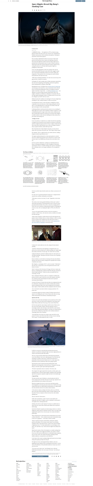

<!-- PROJECT LOGO -->

# Project: New York Times Article Page

## What's this

This project was completed as part of the [HTML and CSS](https://www.theodinproject.com/courses/html-and-css) course at [The Odin Project](https://www.theodinproject.com/). It involves building a replica of [this article](https://www.nytimes.com/2014/03/18/science/space/detection-of-waves-in-space-buttresses-landmark-theory-of-big-bang.html?_r=0) on New York Times to experiment  with the inclusion of multimedia content and practice positioning techniques like Grid, Flex and Floats. The full assignment can be found [here](https://www.theodinproject.com/courses/html-and-css/lessons/positioning-and-floating-elements).

## Live Demo

Check the [live demo](https://pandenok.github.io/new-york-times-article-page/)  
  
 -- or --    

  
Click to see screenshots

  

    
  

  

## Built With

- HTML
- CSS

## Reflection

- I was very tempted to draw up the layout fixing some alignments and spannings of original website, but at the end of the day the task was to build a replica, so you'll see all the strange spaces and paragraphs of the original.  
- Flexbox was used for the main layout and the most part of elements, and it seemed right to use Grid for the inclusion on the "Theory of Inflation". 
- I decided to practice some tree-structural pseudo-classes as well, so there are almost no classes or ids in html file. 
- I used [this solution](https://stackoverflow.com/questions/5581034/is-there-are-way-to-make-a-child-divs-width-wider-than-the-parent-div-using-css) to make a child wider than its parent for some media elements using Flexbox with just three lines of CSS
- To increase my productivity and avoid switching and updating browser at any change I integrated [BrowserSync](https://browsersync.io/)

## Show your support

Give a :star: if you like this project!